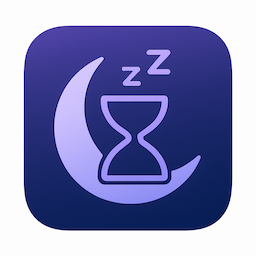

# portable-async-sleep



A portable async sleep function for Rust.

This crate provides a runtime-agnostic implementation of async sleep functionality.
Unlike runtime-specific sleep functions (e.g., `tokio::time::sleep` or `async_std::task::sleep`),
`portable_async_sleep` works with any async runtime or executor.

## Features

- **Runtime-agnostic**: Works with tokio, async-std, smol, or any other async runtime
- **Lightweight**: Uses standard library primitives with minimal overhead
- **Thread-safe**: Can be used from multiple async tasks simultaneously
- **Accurate timing**: Respects the requested sleep duration

## Implementation

The default implementation uses a dedicated background thread that manages sleep timers using
standard library channels and timeouts. This approach ensures maximum compatibility across
all async runtimes while maintaining good performance.

While the stdlib-based implementation is the most portable, the crate is designed to support
alternative backends in the future that may offer better performance or integration with
specific runtimes, while still maintaining the same portable API.

## Examples

Basic usage:

```rust
use portable_async_sleep::async_sleep;
use std::time::Duration;

async fn example() {
    async_sleep(Duration::from_millis(100)).await;
    println!("Slept for 100ms!");
}
```

Using with concurrent tasks:

```rust
use portable_async_sleep::async_sleep;
use std::time::{Duration, Instant};

async fn concurrent_example() {
    let start = Instant::now();

    // Start two sleep operations concurrently
    let sleep1 = async_sleep(Duration::from_millis(100));
    let sleep2 = async_sleep(Duration::from_millis(200));

    // Wait for both to complete
    futures::join!(sleep1, sleep2);

    // Total time should be ~200ms, not 300ms
    let elapsed = start.elapsed();
    assert!(elapsed >= Duration::from_millis(200));
    assert!(elapsed < Duration::from_millis(250));
}
```

## License

This project is licensed under either of

 * Apache License, Version 2.0, ([LICENSE-APACHE](LICENSE-APACHE.md) or http://www.apache.org/licenses/LICENSE-2.0)
 * MIT license ([LICENSE-MIT](LICENSE-MIT.md) or http://opensource.org/licenses/MIT)

at your option.